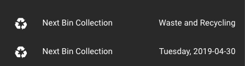

# Bin Collection tracker for Home Assistant

This is a simple _sensor_ for keeping track of the state of rubbish or
recycling collection at your home.  At present, it is highly opionated, being
a weekly collection for waste and fortnightly collection for waste and
recycling, but it may be expanded later on.



## Installation

Copy or symlink the `bin_collection/` folder to
`custom_components/bin_collection` within your configuration directory,
creating the `custom_components/` directory if it doesn't already exist.

Add a sensor into your `configuration.yaml` file like so:

```yaml
  - platform: bin_collection
    weekday: tue
    recycling_epoch: 2019-02-05
```

## Configuration

`weekday`: the day of the week that your bins are collected, in lower-case,
three-letter form

`recycling_epoch`: any given date that your recyling was collected at any one
point in the past.  This gets used as a basis for checking if a future bin
collection date is a recycling day, since any future collection date depends
on the past.

## Usage

You'll now have sensors `sensor.next_bin_collection` and
`sensor.next_bin_collection_date` available for use within your dashboard.

## Contributing

PRs are welcome but open an issue first to discuss anything major.

## Licence

MIT; see `LICENSE.txt`.
